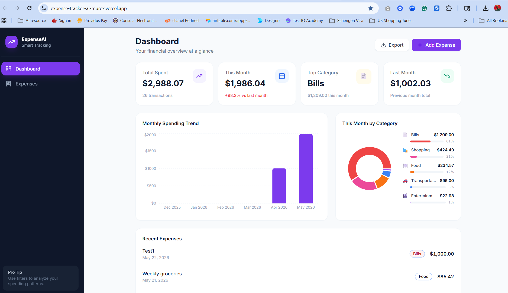
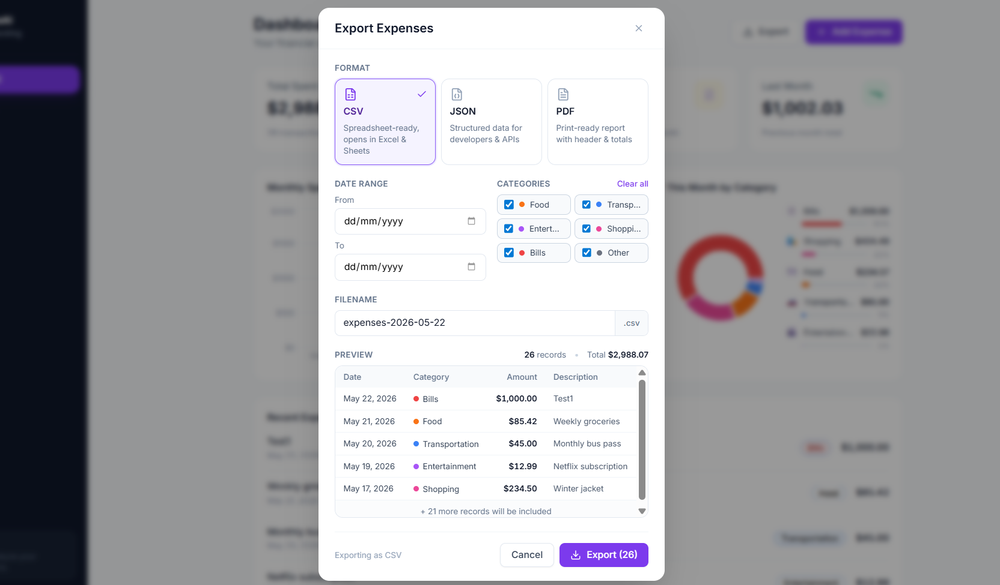
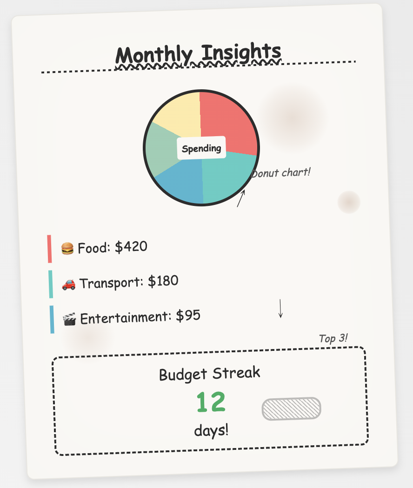

# Expense Tracker

A modern personal-finance dashboard for tracking expenses with month-over-month trends, category breakdowns, and configurable CSV / JSON / PDF exports — built entirely client-side. 

> *Originally built as a hands-on exercise during Vanderbilt University's [Generative AI Software Engineering Specialization](https://www.coursera.org/specializations/generative-ai-software-engineering) on Coursera. It marks an early milestone in my broader journey toward becoming a Digital Transformation and AI Literacy Expert — with more substantive products and case studies to follow.*

**Live demo:** **[expense-tracker-ai-murex.vercel.app](https://expense-tracker-ai-murex.vercel.app)**

[](https://nextjs.org)
[](https://www.typescriptlang.org/)
[](https://tailwindcss.com/)
[](https://recharts.org/)
[](https://vercel.com)



---

## Overview

A polished single-user expense tracker that runs entirely in the browser — no backend, no database, no auth required. All state persists locally via `localStorage`, making it instant to load, free to host, and trivial to fork.

The project doubles as a study in **deliberate design tradeoffs**: the export feature was built three different ways (simple, advanced, cloud-style) before the middle approach was chosen as the production version. The two unused implementations remain in the repo as documented alternatives — see [_A note on the design process_](#a-note-on-the-design-process) below.

---

## Features

### 📊 Dashboard
- Live monthly spending trend (6-month bar chart)
- Category breakdown (donut chart with custom legend)
- Summary cards: total spent, this month, last month, top category
- Recent expenses preview with quick edit/delete

### 💸 Expense management
- Add / edit / delete with inline validation (amount, category, description, date)
- Search, multi-filter, and multi-column sort
- Sample data seeded on first visit so the UI is never empty

### 📤 Configurable export
- CSV / JSON / PDF formats (PDF rendered via `jsPDF` + `jspdf-autotable`)
- Date-range and category filters with cross-validation
- Live record count + total amount preview before export
- Custom filename input with auto-suffixed extension
- Scrollable preview table of the first matching rows



### ✨ Monthly Insights
- Spending donut with the month's total at the center
- Top 3 categories for the month with Lucide icons, amounts, and transaction counts
- Budget Streak callout (currently a placeholder — a settable monthly cap is tracked in [issue #4](https://github.com/emekaakano/expense-tracker-ai/issues/4))

### ⚡ Quality details
- Responsive across mobile, tablet, and desktop
- Hydration-safe Recharts integration (avoids SSR/CSR mismatch)
- Accessible modal with `Escape` to close + backdrop click
- Zero external API calls — works offline after first load

---

## A note on the design process

Rather than implementing the export feature once, three competing approaches were prototyped on separate branches to study the tradeoffs:

| Branch | Approach | Status |
|---|---|---|
| [`feature-data-export-v1`](../../tree/feature-data-export-v1) | **Simple** — one-click CSV download from a button on the dashboard | Closed — useful as a low-friction reference |
| [`feature-data-export-v2`](../../tree/feature-data-export-v2) | **Advanced** — modal dialog with format picker, filters, live preview, and loading states | ✅ **Shipped** |
| [`feature-data-export-v3`](../../tree/feature-data-export-v3) | **Cloud Hub** — slide-in drawer with simulated Google Sheets / Drive / Dropbox / OneDrive integration, share links + QR codes, recurring backup schedule, and an activity feed | Closed — kept as a stretch-scope exploration |

The v2 ("advanced") implementation was chosen for the best balance of power, polish, and complexity. The unused versions remain visible as [closed pull requests](../../pulls?q=is%3Apr+is%3Aclosed) for context.

For a full technical comparison of the three implementations — architecture, complexity, security, performance, and recommendation matrix — see [**code-analysis.md**](./code-analysis.md).

---

## From napkin to screen

The Monthly Insights screen started as a literal napkin sketch — donut chart, top 3 categories, a streak counter — and was implemented end-to-end from that image:



The shipped version lives at [`/insights`](https://expense-tracker-ai-murex.vercel.app/insights) on the live demo. A few notable translations from sketch to code:

- **Donut with "Spending" label** → Recharts donut with the month's total as a centered overlay, using the existing SSR-safe `mounted` guard pattern.
- **Top 3 categories** → first three results from `getCategoryTotals`, rendered with Lucide icons in tinted squares and a colored left-border bar to match the rest of the app.
- **Budget Streak** → dashed-border card that echoes the hand-drawn box on the napkin. The 12-day value is currently mocked via a `BUDGET_STREAK_DAYS` constant because the data model has no budget field yet — a proper settable monthly cap is tracked in [issue #4](https://github.com/emekaakano/expense-tracker-ai/issues/4).

The interesting work here wasn't writing the component — it was surfacing the ambiguities in the sketch (what *is* a "budget streak" without a budget?) and getting explicit decisions on them before any code was written.

---

## Tech stack

| Layer | Choice |
|---|---|
| Framework | **Next.js 14** (App Router) |
| Language | **TypeScript** |
| Styling | **Tailwind CSS** |
| Charts | **Recharts 3** |
| Icons | **Lucide React** |
| PDF generation | **jsPDF** + **jspdf-autotable** |
| State | **React Context** + `useState` |
| Persistence | **`localStorage`** |
| Hosting | **Vercel** (auto-deploy on push to `master`) |

No backend, no database, no third-party APIs. The entire app ships as a static client-side bundle.

---

## Project structure

```
app/
  page.tsx              Dashboard route (summary + charts + recent)
  expenses/page.tsx     Full expense list with filter + sort
  layout.tsx            Root layout with ExpenseProvider

components/
  dashboard/            Summary cards, monthly chart, category chart
  expenses/             List, form modal, filters
  export/               ExportDialog (modal with format picker + filters)
  layout/               Header, Sidebar, MobileNav
  ui/                   Button, Modal — reusable primitives

context/
  ExpenseContext.tsx    Single source of truth for expense state

lib/
  types.ts              Shared TypeScript types
  constants.ts          Category metadata (colors, icons, badges)
  storage.ts            localStorage read/write + sample data seed
  utils.ts              Currency / date formatting + monthly totals
  export.ts             CSV / JSON / PDF export utilities
```

---

## Running locally

```bash
git clone https://github.com/emekaakano/expense-tracker-ai.git
cd expense-tracker-ai
npm install
npm run dev
```

Open [http://localhost:3000](http://localhost:3000).

### Other useful commands

| Command | Purpose |
|---|---|
| `npm run dev` | Start dev server with hot reload |
| `npm run build` | Production build |
| `npm start` | Serve the production build locally |
| `npm run lint` | ESLint over the codebase |
| `npx tsc --noEmit` | Type-check without emitting JS |

---

## Deployment

This project is deployed to [Vercel](https://vercel.com) and configured to auto-deploy on every push to `master`. Each push triggers:

1. Install dependencies
2. Run `next build` (which includes type-checking + ESLint)
3. Serve the optimized static bundle

No special configuration is required — Vercel auto-detects Next.js. To deploy your own copy, fork this repo and import it into Vercel.

---

## License

MIT — feel free to use this as a starting point or reference.
